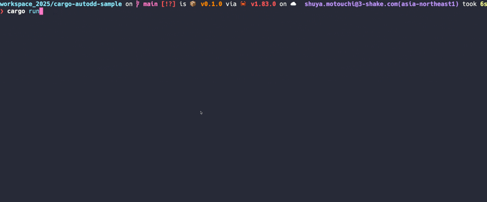

# 📦 cargo-autodd

A tool that automatically manages Rust dependencies by analyzing your source code and updating Cargo.toml

## 🔍 Overview

cargo-autodd simplifies Rust dependency management by automatically adding required crates to your Cargo.toml based on `use` statements and `extern crate` declarations in your code. 



## ✨ Features

- 🔎 Scans Rust source files for imports
- 🤖 Automatically detects required dependencies
- ⬆️ Updates Cargo.toml with the latest stable versions
- 🗑️ Removes unused dependencies
- 🛠️ Leverages rust-analyzer for better code analysis (when available)

## 📥 Installation

```bash
cargo install cargo-autodd
```

## ⚙️ Requirements

- 🦀 Rust 1.70.0 or later
- 📦 Cargo
- 🔧 rust-analyzer (optional, but recommended)

## 🚀 Usage

In your Rust project directory:

```bash
cargo autodd
```


## 🔄 How It Works

1. 📝 Analyzes your Rust source files
2. 🔍 Detects import statements and external crate declarations
3. ⚡ Updates Cargo.toml with required dependencies
4. ✅ Verifies changes with `cargo check`

## 👥 Contributing

Contributions are welcome! Please feel free to submit a Pull Request.

## 📜 License

MIT

## 👤 Author

nwiizo ([@nwiizo](https://x.com/nwiizo))
